# 2048 游戏数据流设计文档

**文档版本：** v1.0  
**创建日期：** 2026-03-26  
**关联文档：** [2048_game_prd.md](../requirements/2048_game_prd.md)

---

## 1. 整体数据流架构

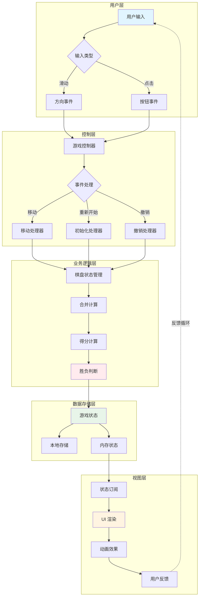

---

## 2. 核心数据流详解

### 2.1 游戏初始化流程

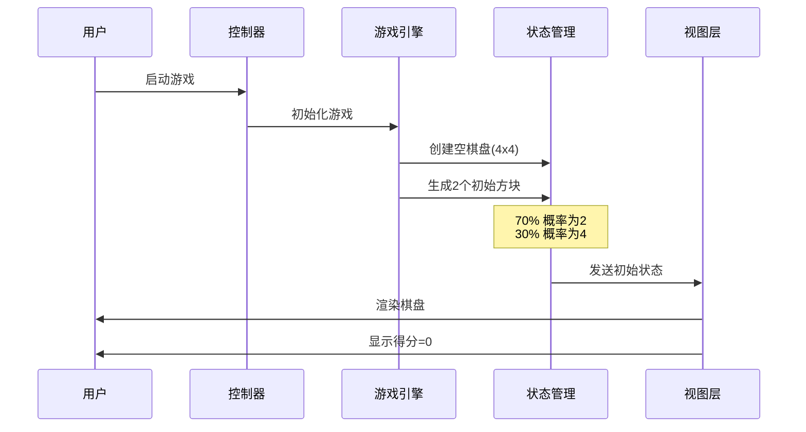

### 2.2 方块移动流程

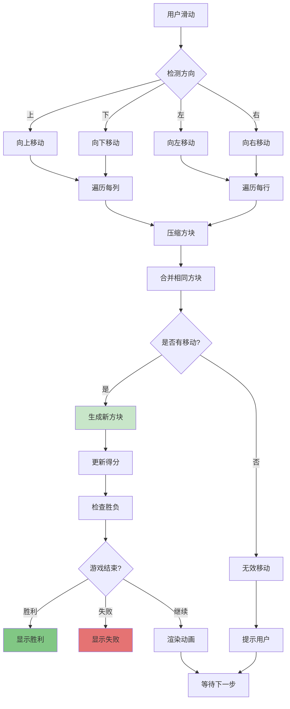

### 2.3 方块合并算法

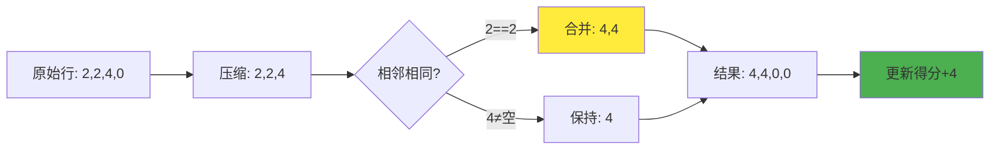

### 2.4 新方块生成流程

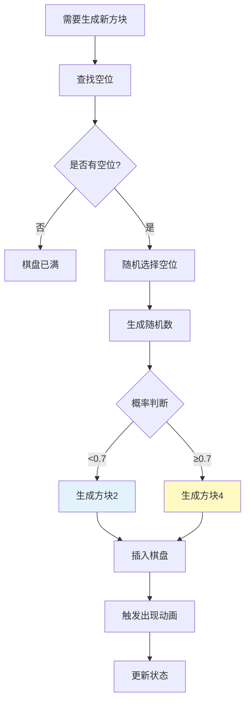

---

## 3. 状态管理数据流

### 3.1 状态树结构

```mermaid
graph TB
    A[GameState] --> B[board: Tile[][]]
    A --> C[score: number]
    A --> D[bestScore: number]
    A --> E[gameStatus: Status]
    A --> F[history: State[]]
    A --> G[undoCount: number]
    
    B --> H[Tile: {value, id, merged}]
    E --> I[Status: playing/won/lost]
    F --> J[用于撤销功能]
    
    style A fill:#bbdefb
    style E fill:#ffccbc
    style F fill:#c5cae9
```

### 3.2 状态更新流程

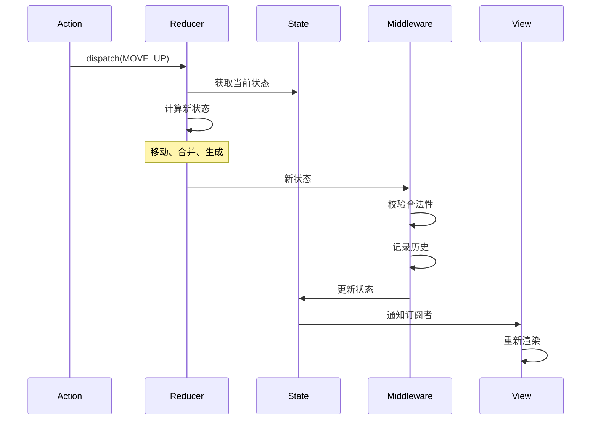

---

## 4. 数据持久化流程

### 4.1 本地存储流程

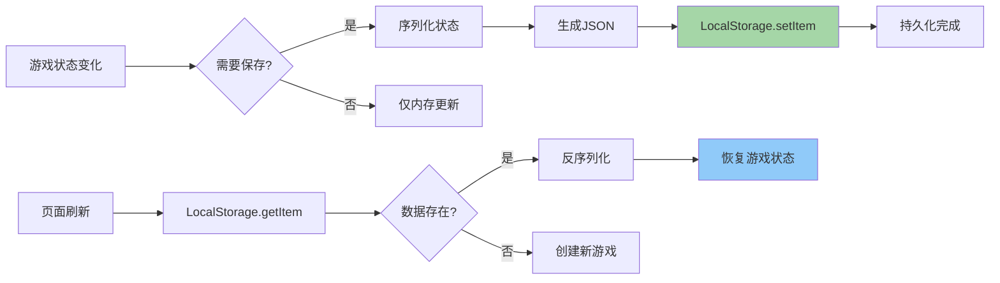

### 4.2 存储数据结构

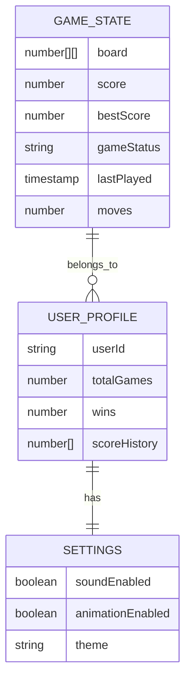

---

## 5. 实时交互数据流

### 5.1 用户输入处理

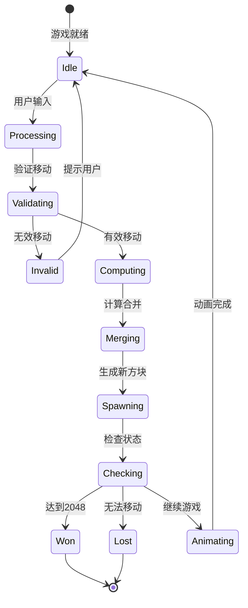

### 5.2 动画队列流程

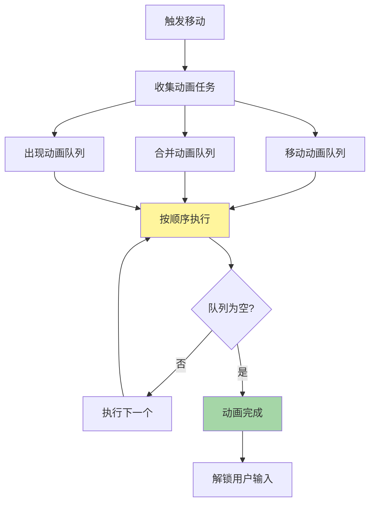

---

## 6. 网络同步数据流（可选功能）

### 6.1 云端同步架构

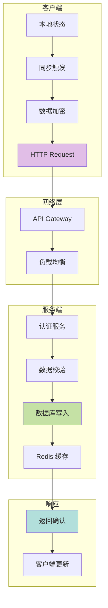

### 6.2 排行榜数据流

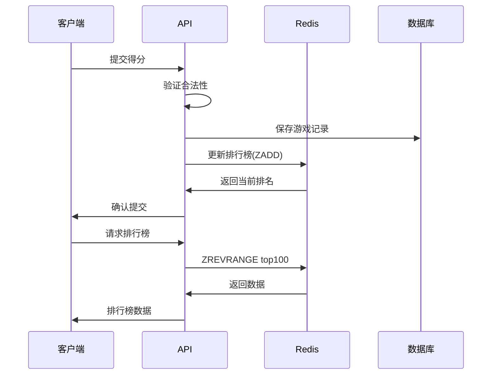

---

## 7. 性能优化数据流

### 7.1 渲染优化

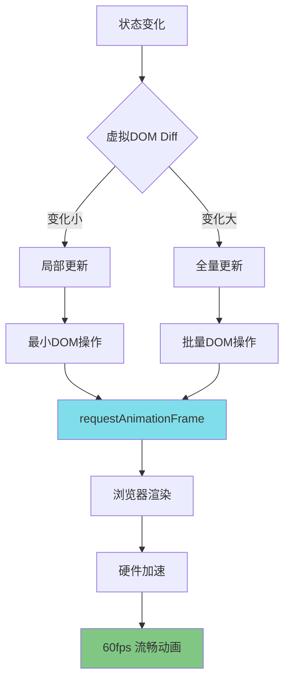

### 7.2 缓存策略

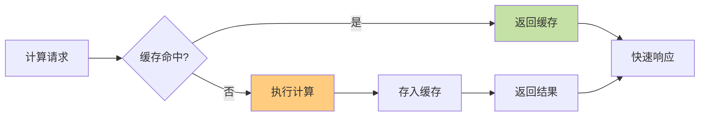

---

## 8. 错误处理数据流

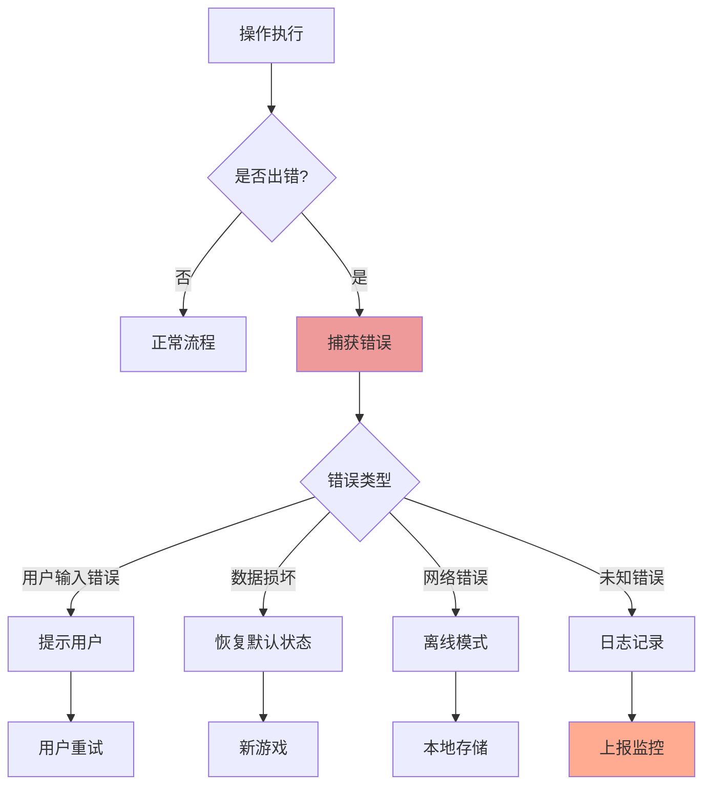

---

## 9. 数据结构定义

### 9.1 核心类型

```typescript
// 棋盘方块
interface Tile {
  id: string;          // 唯一标识
  value: number;       // 数值 (2, 4, 8, ...)
  position: Position;  // 位置
  merged?: boolean;    // 是否刚合并
}

// 位置
interface Position {
  row: number;
  col: number;
}

// 游戏状态
interface GameState {
  board: (Tile | null)[][];  // 4x4 棋盘
  score: number;              // 当前得分
  bestScore: number;          // 最高分
  gameStatus: 'playing' | 'won' | 'lost';
  history: GameState[];       // 历史状态(撤销)
  undoCount: number;          // 剩余撤销次数
}

// 移动方向
type Direction = 'up' | 'down' | 'left' | 'right';

// 动画任务
interface AnimationTask {
  type: 'move' | 'merge' | 'spawn';
  tile: Tile;
  from?: Position;
  to?: Position;
  duration: number;
}
```

---

## 10. 数据流总结

### 关键路径
1. **用户输入** → 事件处理 → 状态更新 → 视图渲染
2. **状态变化** → 本地存储 → 数据持久化
3. **游戏逻辑** → 合并计算 → 得分更新 → 胜负判断

### 性能关键点
- 🚀 使用虚拟 DOM 减少渲染开销
- 🎯 动画队列管理避免卡顿
- 💾 本地存储缓存减少计算
- ⚡ requestAnimationFrame 保证 60fps

### 扩展性考虑
- 📊 预留网络同步接口
- 🏆 支持排行榜和社交功能
- 🎨 可配置主题和动画
- 📱 响应式设计适配多端

---

**文档版本：** v1.0  
**最后更新：** 2026-03-26  
**维护者：** 刘伟世

> 💡 **提示：** 所有流程图使用 Mermaid 格式，可直接在 GitHub/Markdown 编辑器中渲染。
